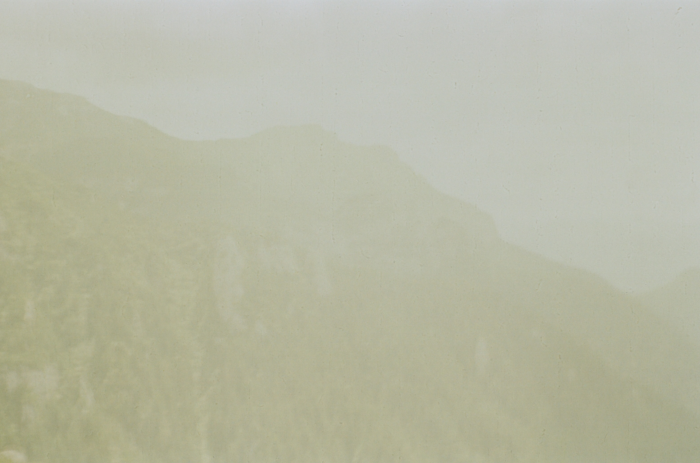

<!-- Render the images and descriptions side by side -->

A selection of spectrogram & audio samples, produced by applying transformations to neural network architecture, using the Brave synthesiser. 

  
  

    
<strong>Here is the text</strong> next to the image.

    
This will render properly on GitHub.

  

<audio controls style="width: 350px;">
  <source src="audio/sample.wav" type="audio/mpeg">
  Your browser does not support the audio element.
</audio>

  
  

    
Applying a &Delta;x transformation of 14 at encoder 15.

  

