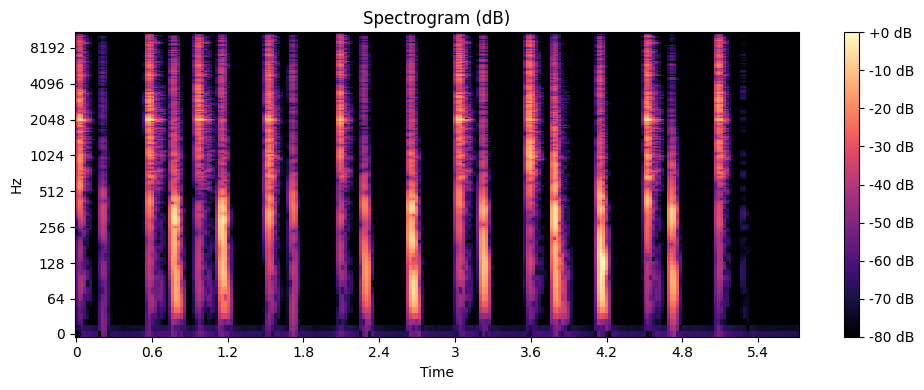
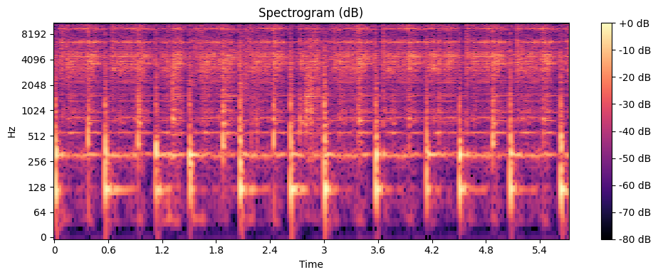
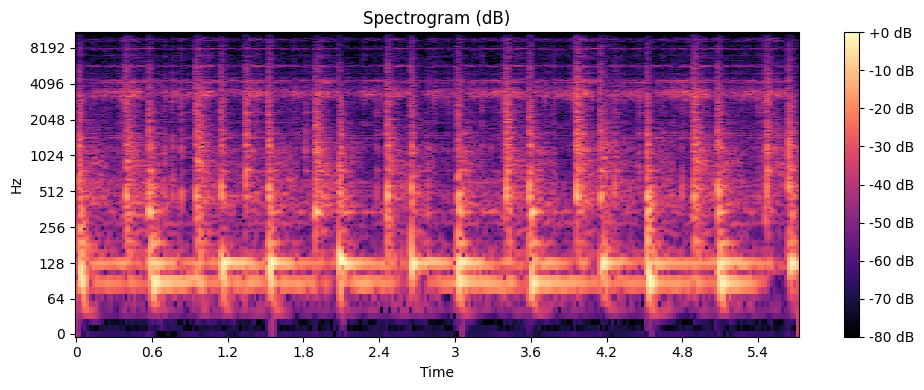
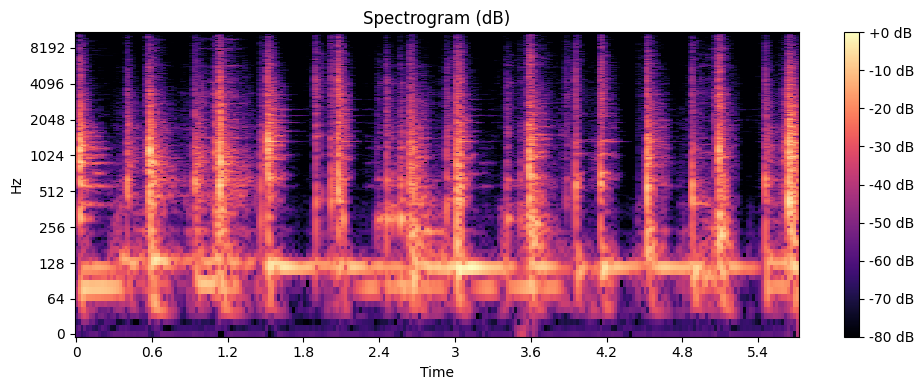
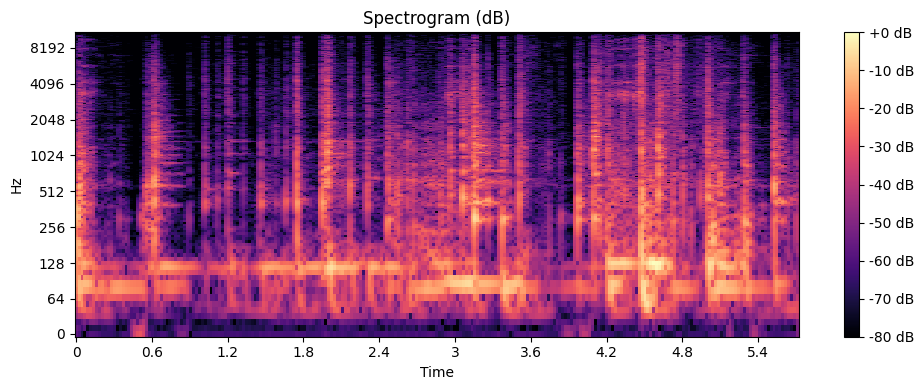

<!-- Rendering the spectrograms, alongside a description and the audio file -->

A selection of spectrogram & audio samples, produced by applying transformations to neural network architecture, using the 
Brave synthesiser. Here, I present a spectrogram/raw audio file of the samples, along with a description of the transformations
that have been applied.

  
  

    

      
The darbouka RAVE model without any transformations applied to the underlying network. This should act as a baseline when inspecting the other samples.

    

    <audio controls style="width: 350px; margin-top: 10px;">
      <source src="audio/sample.wav" type="audio/mpeg">
      Your browser does not support the audio element.
    </audio>
  

  
  

    

      
Adding a bias to all weights in layer encoder.1.net.bias, &Delta;y = 0.47.

    

    <audio controls style="width: 350px; margin-top: 10px;">
      <source src="audio/sample1.wav" type="audio/mpeg">
      Your browser does not support the audio element.
    </audio>
  

  
  

    

      
<strong>Here is the text</strong> next to the image.

      
This will render properly on GitHub.

    

    <audio controls style="width: 350px; margin-top: 10px;">
      <source src="audio/sample2.wav" type="audio/mpeg">
      Your browser does not support the audio element.
    </audio>
  

  
  

    

      
<strong>Here is the text</strong> next to the image.

      
This will render properly on GitHub.

    

    <audio controls style="width: 350px; margin-top: 10px;">
      <source src="audio/sample3.wav" type="audio/mpeg">
      Your browser does not support the audio element.
    </audio>
  

  
  

    

      
<strong>Here is the text</strong> next to the image.

      
This will render properly on GitHub.

    

    <audio controls style="width: 350px; margin-top: 10px;">
      <source src="audio/sample4.wav" type="audio/mpeg">
      Your browser does not support the audio element.
    </audio>
  

  
  

    

      
<strong>Here is the text</strong> next to the image.

      
This will render properly on GitHub.

    

    <audio controls style="width: 350px; margin-top: 10px;">
      <source src="audio/sample5.wav" type="audio/mpeg">
      Your browser does not support the audio element.
    </audio>
  

